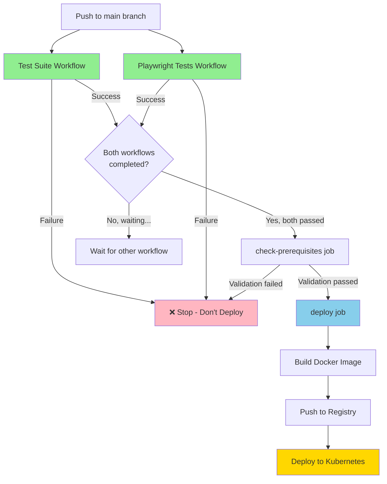

# Workflow Dependency Flow

## Current Setup

```
┌─────────────────────────────────────────────────────────────┐
│                    Push to main branch                      │
└─────────────────┬───────────────────────────────────────────┘
                  │
         ┌────────┴────────┐
         │                 │
         ▼                 ▼
  ┌─────────────┐   ┌─────────────┐
  │ Test Suite  │   │ Playwright  │
  │  (test.yaml)│   │ Tests       │
  │             │   │ (e2e.yaml)  │
  └──────┬──────┘   └──────┬──────┘
         │                 │
         │                 │
    ✅ Success         ✅ Success
         │                 │
         └────────┬────────┘
                  │
                  ▼
         ┌────────────────────┐
         │  workflow_run      │◄─── Triggers when EITHER completes
         │  triggers          │
         └────────┬───────────┘
                  │
                  ▼
         ┌────────────────────┐
         │ check-prerequisites│
         │ job                │
         │                    │
         │ • Query GitHub API │
         │ • Verify BOTH      │
         │   workflows passed │
         │ • Set output flag  │
         └────────┬───────────┘
                  │
         all-passed=true?
                  │
                  ▼
         ┌────────────────────┐
         │   deploy job       │
         │                    │
         │ if: all-passed &&  │
         │     ref == main    │
         └────────┬───────────┘
                  │
                  ▼
         ┌────────────────────┐
         │ 🚀 Deploy to K8s   │
         └────────────────────┘
```
